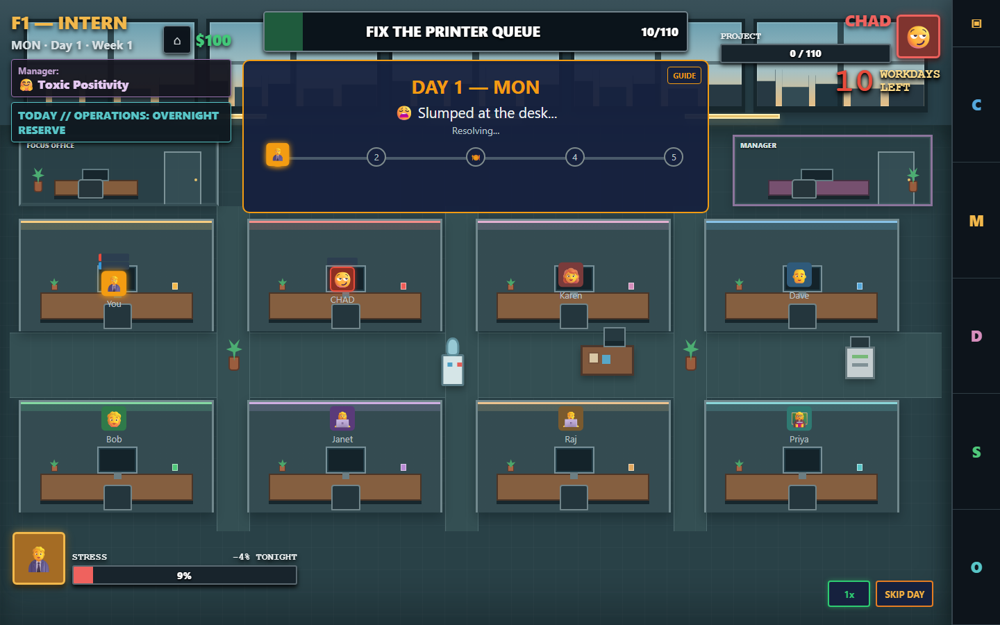
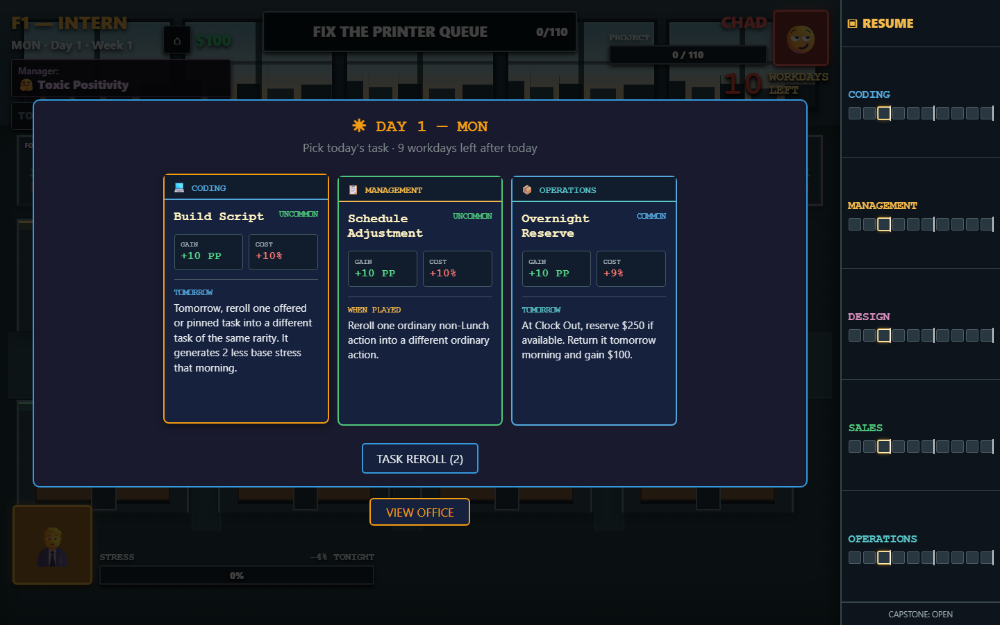
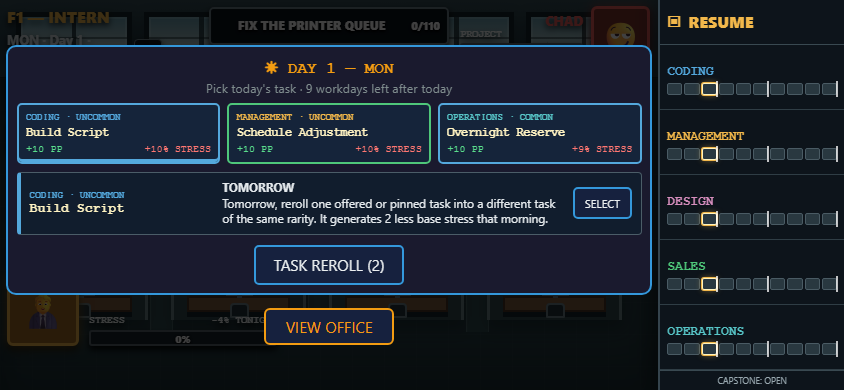

<div align="center">

# 🏢 OfficeWars

**Do the work. Dodge the drama. Survive the org chart.**

A single-file office autobattler about climbing seven corporate floors before
stress, deadlines, or your rival end the run.

[**▶ Play OfficeWars**](https://mewzicians.github.io/OfficeWars/officewarsautobattler.html) ·
[Project status](docs/PROJECT_STATUS.md) ·
[Contributing](CONTRIBUTING.md) ·
[Playtest guide](docs/PLAYTEST_GUIDE.md)


</div>



> **Current status:** OfficeWars is a playable development candidate, not a
> finished balance release. Readability, run persistence, first-day
> orientation, and the highest-risk interactions pass the current verification
> suites. The current headless Night policy fails one player-rules parity
> check, so fresh balance simulation and human playtesting remain the next
> release gates.

## Play

No installation, server, account, or build step is required.

1. [Play in your browser](https://mewzicians.github.io/OfficeWars/officewarsautobattler.html), or download
   this repository and open `officewarsautobattler.html`.
2. Pick a task, shape your build, and let the workday play out.
3. Continue an active run after refreshing or leaving the page.
4. On a phone, rotate to landscape.

## The Workday, Weaponized

| Phase | Your move |
|---|---|
| **Morning** | Choose from Coding, Management, Design, Sales, and Operations task cards. |
| **Workday** | Watch, accelerate, or skip a deterministic office simulation without changing its outcome. |
| **Night** | Spend, recover, build relationships, and improve your Home. |
| **Weekend** | Navigate mystery events, casino detours, and the consequences of your week. |
| **Promotion** | Claim family traits and carry your build toward the CEO's Office. |

Build around 50 ordinary task cards, fixed rarities, 14 visible trait paths,
a hidden Campaign path, eight managers, an eight-cubicle office, and unusual
win conditions such as Brand Strategy Campaigns and Closing's multi-day Sales
Cycle.

<table>
  <tr>
    <td width="50%">
      
      <br><sub><b>Choose your work.</b> Every card advances a family and nudges the run in a different direction.</sub>
    </td>
    <td width="50%">
      
      <br><sub><b>Take it with you.</b> The full office fits into a landscape phone layout.</sub>
    </td>
  </tr>
</table>

## Project Status

Structural balance remains open. Prior simulation telemetry is historical
until the headless Night policy obeys the same purchase-versus-Lights-Out rule
as players. Read [Project Status](docs/PROJECT_STATUS.md) before changing
balance.

## Project Map

| Path | Purpose |
|---|---|
| `officewarsautobattler.html` | Implemented game and source of runtime truth |
| `docs/GAME_DESIGN.md` | Stable product and gameplay model |
| `docs/BALANCE_LEDGER.md` | Implemented values, locked decisions, and open questions |
| `docs/HANDOFF.md` | Current implementation and verification handoff |
| `docs/WORKING_WITH_AGENTS.md` | How humans and AI agents collaborate on this project |
| `AGENTS.md` | Repository instructions for coding agents |
| `verification/` | Dated verification evidence |
| `.officewars-*.py` | Optional Playwright verification and simulation tools |

Historical ideas are not active requirements. Use
[`docs/ARCHIVE_SUPERSEDED.md`](docs/ARCHIVE_SUPERSEDED.md) only when the reason
behind an old direction matters.

## Contributing

Start with [CONTRIBUTING.md](CONTRIBUTING.md). Balance proposals should include
the affected floor, build, failure mode, and evidence. A measured outlier is a
reason to investigate, not an automatic nerf.

AI-assisted work is welcome when the agent follows
[Working With Agents](docs/WORKING_WITH_AGENTS.md), verifies claims against the
HTML, and clearly distinguishes proposals from approved decisions.

## Optional Verification

```powershell
python -m pip install -r requirements-dev.txt
python -m playwright install chromium
python .officewars-smoke-run.py
python .officewars-persistence-verify.py
python .officewars-advanced-verify.py
python .officewars-full-verify.py 0
```

The game itself has no Python dependency. These commands are only for
development and verification.
